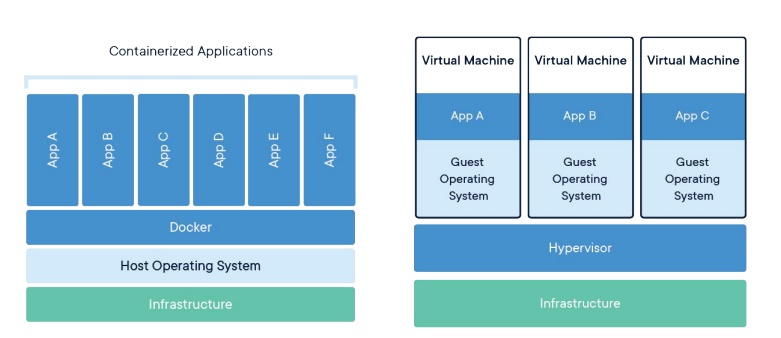
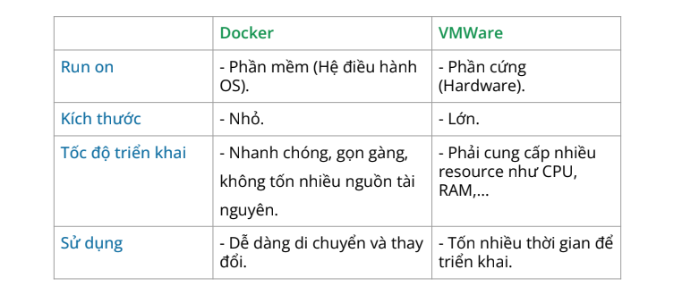
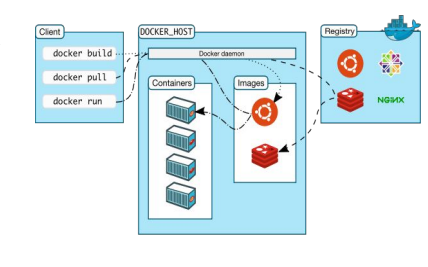
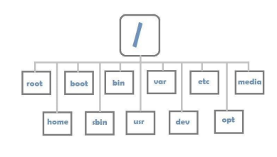

# Introduction to Docker

## Table of contents

1. Tại sao phải sử dụng docker
2. Tìm hiểu Docker là gì?
3. Sự khác nhau của Docker và VMWARE
4. Tìm hiểu về Docker Architecture
5. Tìm hiểu về Linux và các lệnh hay sử dụng
6. Tìm hiểu và sử dụng các Image có sẵn

## 1. Tại sao phải sử dụng Docker?

Sơ khai (trước khi có công nghệ Visualization)
-> Sử dụng Server Vật Lý để deploy server
-> Thiết lập môi trường và cấu hình -> Thiết lập mạng cho Server

Một số nhược điểm của việc sử dụng server vật lý để deploy:

- Phức tạp trong quá trình cấu hình
- Phức tạp trong việc Monitor Server và quản lý số lượng lớn
- Không linh động trong việc thay đổi mô trường
- Mất nhiều thời gian trong quá trình khởi động server
- Tốn chi phí để mở rộng và duy trì

-> Visualizations (Ảo hoá) được ra đời

Sau khi có công nghệ Visualization(Ảo hoá):

- Cài đặt các phần mềm Visualization như
  (VMWARE, VIRTUALBOX) trên Server nhỏ
  gọn và dễ dàng.
- Thiết lập được nhiều môi trường trên
  Server
- Dễ dàng thao tác tạo, xoá.
- Visualization giống như một phần mềm ảo và bắt chước các tính năng của một phần cứng
- Hypervisor là một phần mềm tạo ra Virtual Machine
- Virtual Machine là một file Clone lại toàn bộ các thành phần của Physical Machine (Ảo hoá phần cứng dựa trên việc chia sẻ phần cứng gồc) -> nói là ảo nhưng mà lại chạy như thật.

Lý do **Docker** ra đời:

- Cài đặt nhanh chóng và dễ dàng
- Có thể cài đặt trên nhiều môi trường
- Kích thước nhỏ nên việc khởi tạo được rút ngắn
- Linh động trong việc thay đổi môi trường hoặc cài đặt
- Chiếm ít Resource (tài nguyên) của Server nên có thể tạo được nhiều Instance hơn (Cắt và sử dụng tài nguyên một cách linh động -> Cắt nhưng có thể chia sẻ khi không sử dụng.)

## 2. Tìm hiểu Docker là gì?

Docker là một nền tảng gồm các tính năng giúp cho người sử dụng có thể build và run các Service bằng cách sử Container.

## 3. Sự khác nhau giữa Docker và VMWARE

## 4. Tìm hiểu Docker Architecture

Kiến trúc Docker gồm một số thành phần:

- **Client**: Cung cấp các chức năng để thay đổi các thành phần Docker nhưu là Container, Image, Network, Volumns, ... bằng các sử dụng RestAPI, Socket để giao tiếp với Server
- **Server**: Nơi nhận request từ Client để thực thi và cũng là nơi chưa các thành phần quan trọng như là Container, Image, ...
  - **Docker Daemon**: Một process daemon dùng để quản lý (create, remove, build) Container, Image, ...
- **Docker Registry**: Nơi lưu trữ và chua sẻ Image

## 5. Tìm hiểu về Linux và các câu lệnh hay sử dụng

Trong Linux, những tập tin mà chúng thường thấy và thao tác được cấu trúc theo trạng cây (Tree), với điểm bắt đầu là root. Và Linux được hình thành như nhiều thư mục và tập tin khác nhau.

Tại sao phải tìm hiểu các thành phần trong Linux ?

- Mỗi một tập tin trong hệ thống Linux đều có mục đích riêng.
- Khi Application chạy trên hệ thống sẽ thường xuyên sử dụng những tập tin này để cấu hình, lưu trữ dữ liệu,...
- Hiểu đúng mục đích sử dụng sẽ giúp hệ thống và Application dễ dàng quản lý và an toàn hơn

**/root**
Root là thư mục cao nhất và tất cả các file sẽ nằm trong thư mục này

**/bin**
Đây là thư mục chứa các file thực thi dạng binary, và cũng là các chương trình mà User sẽ sử dụng trong hệ thống.
Một số Image sẽ sử dụng thư mục này chứa file build của Golang để run Application

**/sbin**
Cũng giống như thư mục /bin, sbin cũng chứa các file thực thi binary, thường sẽ là các chương trình quan trọng trong hệ thống vì vậy để sử dụng được thì phải là SuperUser.
Thường sẽ thấy trước câu lệnh có syntax là su.

**/etc**
Đây là một thư một chứa các file cấu hình cho chương trình, thường sẽ là các file dạng text thông thường. Application thường sẽ tới tạo một file cấu hình ở đây để khi Run sẽ đọc tới file để lấy thông số cấu hình cho Application

**/mnt**
Là thư mục chứa các file mount tạm thời của hệ thống

**/tmp**
Thư mục chứa các file được tạo tạm thời bởi hệ thống hoặc User. Các file trong thư mục này sẽ bị xoá khi hệ thống shutdown

**/var**
Thư mục chứa các file thường xuyên thay đổi của hệ thống hoặc Application.
Ví dụ:

- file log của hệ thống: /var/log
- dữ liệu của trang web: /var/www

**/etc**
Thư mục chứa thông tin, cấu hình, dữ liệu cho từng User

**/proc**
Thư mục chứa thông tin xử lý của hệ thống, và thông tin của các process đang chạy
Ví dụ:

- Thông số của CPU: /proc/cpuinfo

Tìm hiểu các lệnh thường dùng trong Linux

- Tìm hiểu và sử về Vagrant
- Cài đặt VMWare
- Tạo Virtual Machine (Ubuntu)
- Thao tác với các tập tin: cd, mkdir, touch, cat,...
- Phân quyền truy cập tập tin [Link](https://viblo.asia/p/phan-quyen-trong-linux-yMnKMbDNZ7P)
- Tạo User và phân quyền
- Thiết lập SSH để truy cập vào Remote Server

Lý thuyết 3 mục cuối có thể tìm hiểu ở đây: [LinuxCommands](./LinuxCommand.md)

## 6. Tìm hiểu và sử dụng các Image có sẵn

DevOps Docker

- Installation Docker
- Tìm hiểu về Docker Hub và các Image có trên Docker Hub
- Sử dụng các Image có sẵn để Run Container
